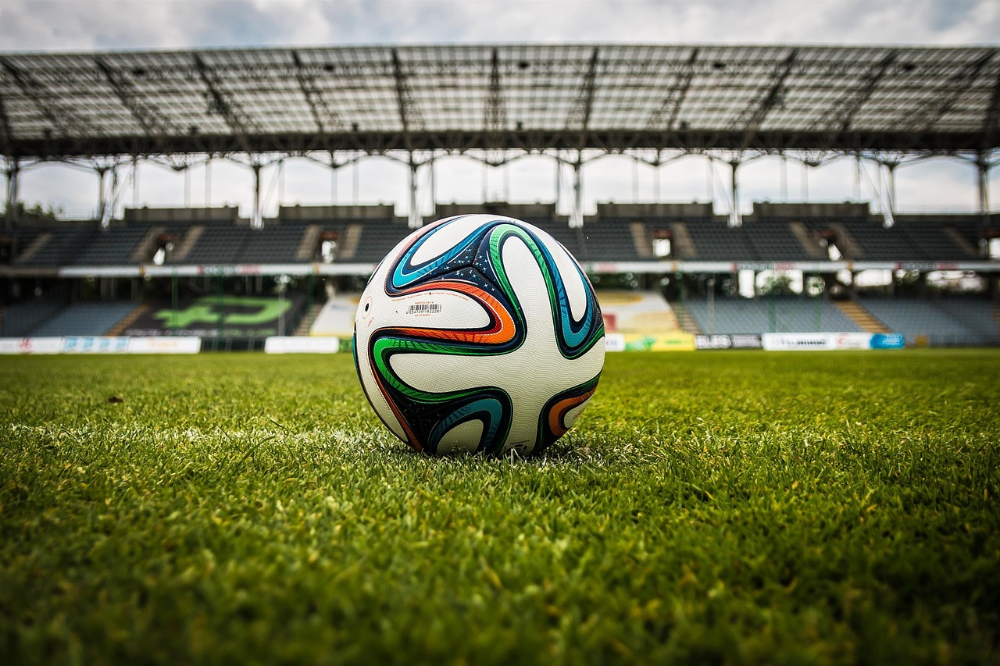
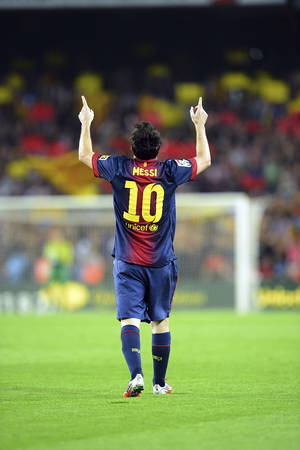

[← Volver al inicio](README.md)
# Temas del curso

### 18/09/2026-Mis aficiones

Levo jugando al futbol desde los siete años,
pase por diferentes equipos como Langreo, Alcázar, 
ahora estoy en el Condal donde estoy muy contento
porque me llevo muy bien con mis compañeros y entrenadores
lo que más me gusta es ganar y si puede ser marcando gol
entreno lunes, miércoles y viernes, los sábados partidos,
también estoy siendo arbitro para ganar dinero y comprarme cosas.

[enlace a un repositorio](https://github.com/jokecamp/FootballData)

### 01/09/2026-Premios Princesa

Yo elegí a Messi porque es uno de los mayores referentes de mi 
infancia aparte porque a mi me encanta el futbol, además
es normal que lo premien ya que es el jugador con más trofeos en el mundo
del futbol y por mucha gente el mejor jugador de la historia,
por eso opino que esta totalmente merecido por todo lo que ha logrado 
y conseguido en toda su carrera profesional futbolística.

[premio princesa Messi](https://www.fpa.es/es/premios-princesa-de-asturias/premiados/2026-leo-messi/?)
